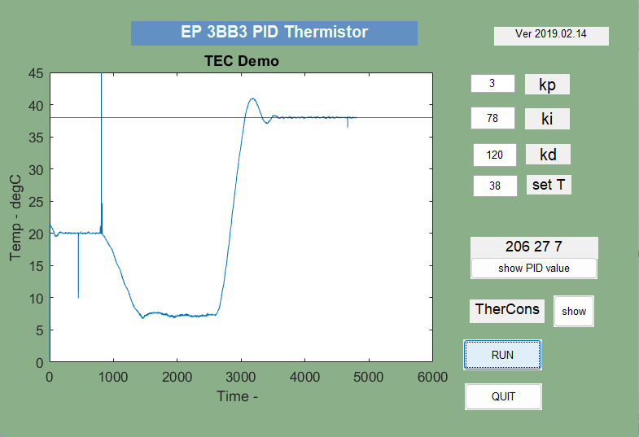
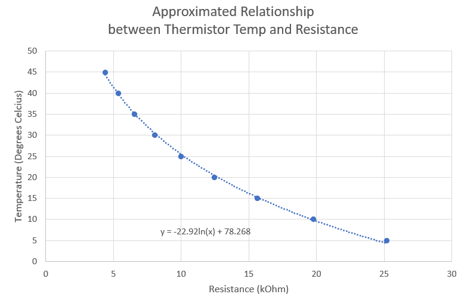

# PID Temperature Controller
**2023.3 - 2023.4**  
This work was done by me and my partner, with a lot of help from TA and Technician. We got discussions and advice from classmates too.  
This project was to build a PID temperature controller that restricted between 5 degrees Celsius and 45 degrees Celsius, by programming MSP430 MCU and serial communicating on MATLAB, physically connecting TEC and H Bridge in circuit to control heating or cooling until the desire temperature was reached, according to a sensed temperature on Thermistor.  
 

### Physically Demonstrate:

 

### Indication on MATLAB GUI
The squiggly lines around some certain level showed a beautiful consistency when it was asked to keep some certain temperature. The overshoot and undershoot looked good and indicated the PID control.  

 
 
 

## Process
### Materials / Components
- MSP430 MCU
- TEC
- H Bridge
- Thermistor
- resistors and jumper wires

 
 

### Thermistor Temperature converted to Resistance
Obtained the approximate relationship by the help of voltage divider.  

 

### Code on MSP430
Initializing UART and ADC all depended on the MCU. It played an important role to take in raw data of voltages on thermistor following a 16MHz clock and serial communicated to MATLAB.  
After getting another data from MATLAB at later time, which determined the on and off duration and therefore formed the PWM signal, MCU sent this signal to TEC and restricted the temperature.  

### Code on MATLAB
MATLAB did all the calculations such as conversion from voltage to temperature (current temperature), difference from expected temperature, three component values (P, I, D), adjustment.  
GUI provided blanks for users to input kp, ki, kp, and displayed the calculated values so that user could have better adjustment for their values.  
Then sent the PID value to MCU through serial communication, and drew the lines on GUI.  
