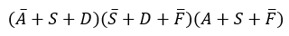
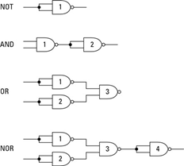
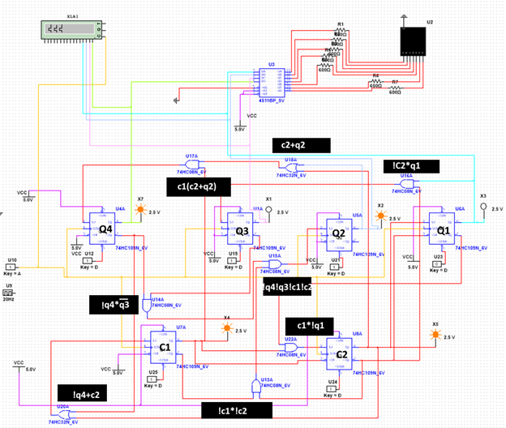
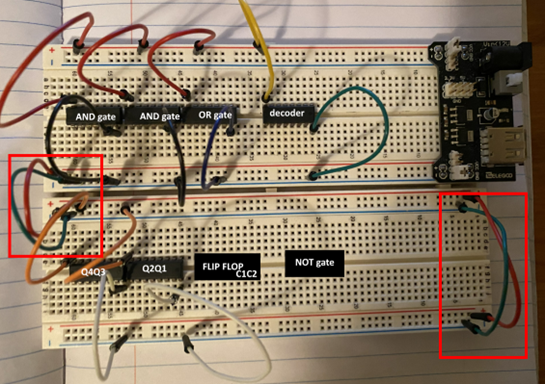
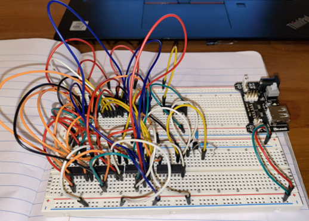
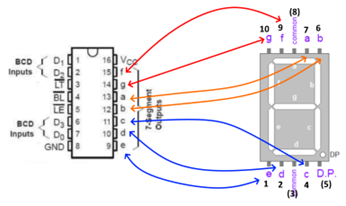
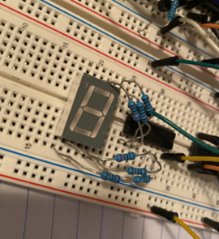

# Sequential Logic Circuit with Blinking LEDs
2021.11 - 2021.12
From course ENGPHYS 2E04. The objective was to create a sequential logic circuit to blink the LEDs in the order of our student number. 
 

_Since 2^3 = 8 < 9 < 2^4, we would need 4 bit binary to represent number. If some numbers repeated, then we would like to add counter number to distinguish._ 
  

> _For instance, <strong>two</strong> 2s would need 1 bit counter numbers: [0],[1];_  

> _<strong>three</strong> 0s would need 2 bit counter numbers [00], [01], [10]._  

 
In total, 4+2=6 bits were required. 
Each bit would need both J and !K to determine. 

 
 
 

## Process
The key point was to find out the logic of this sequence of numbers.  
 

### JK Flip-flop

The second thing was to understand the use of JK flip-flop.  
| J_n | K_n | Q_(n+1) |
| ----------- | ----------- | ----------- |
| 0 | 0 | Q_n(hold) |
| 1 | 1 | 0(reset) |
| 1 | 1 | 1(set) |
| 1 | 1 | !Q_n(toggle) |
 
Now we can generate a table (yes it is long) for J and !K values corresponding to each bit in each individual student number.  
Take student number 2012300 for example. Each of the bits, from Q4 to C1, would have its own J and !K values. 

 
 

| student number | Q4 | Q3 | Q2 | Q1 | C2 | C1 |
| ----------- | ----------- | ----------- | ----------- | ----------- | ----------- | ----------- |
| 2 | 0 | 0 | 1 | 0 | 0 | 0 |
| 0 | 0 | 0 | 0 | 0 | 0 | 0 |
| 1 | 0 | 0 | 0 | 1 | X | X |
| 2 | 0 | 0 | 1 | 0 | 0 | 1 |
| 3 | 0 | 0 | 1 | 1 | X | X |
| 0 | 0 | 0 | 0 | 0 | 0 | 1 |
| 0 | 0 | 0 | 0 | 0 | 1 | 0 |

 

Notice the rows of different 0 and 2. And the single 1 and 3 would be X because it did not matter.  
For this reason, the combination of counter bits can also differ, making it maybe easier or harder for circuit. And it would need to find the optimum case.  
 
 

### SOP/POS

They stand for **sum of products** and **product of sums**.

After we had done **K-mapping** (Karnaugh map, a method to simplify Boolean algebra expressions), usually the same number (1/0) grouped together would be ideal, we could find the expressions. 

 

- :star2: for SOP

_See the example below_:  

 
Boolean expression would be:  

 
 
    
- :star2: for POS

 
Boolean expression would be:  

 
 

They would be further expanded and provide some relationships that are applicable for connecting in circuit with flip-flops and gates. And based on how many kinds and numbers were used, the simplest one was then chosen to connect. 

 

In application, keep in mind that gates are interconvertible.

 
 
 

## Final Product Photos
### NI MultiSim Digital Circuit

 
 

### Physical Built-up Decomposite to Base Setup

 
 

### Physical Built-up Decomposite to Clock Signal Setup

 
 

### Physical Built-up Overview

 
 

### Digital Display and Driver

 
 
